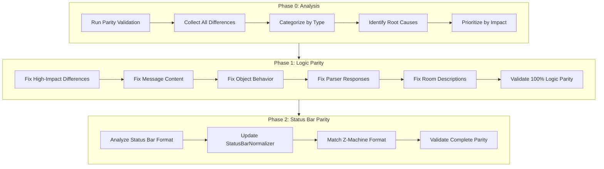

# Design Document: Achieve 100% Parity

## Overview

This design outlines the systematic approach to achieving 100% parity between the TypeScript Zork I implementation and the original Z-Machine. The approach is divided into two phases:

1. **Phase 1: Logic Parity** - Fix all behavioral differences (currently ~67% → 100%)
2. **Phase 2: Status Bar Parity** - Fix formatting differences (optional, for complete output match)

## Architecture



## Components and Interfaces

### Difference Analysis Tool

A script to analyze and categorize all current differences:

```typescript
interface DifferenceAnalysis {
  // Categorized differences
  byType: Map<DifferenceType, ClassifiedDifference[]>;
  // Grouped by root cause
  byRootCause: Map<string, ClassifiedDifference[]>;
  // Prioritized fix list
  prioritizedFixes: FixRecommendation[];
  // Summary statistics
  summary: AnalysisSummary;
}

interface FixRecommendation {
  // Unique identifier for this fix
  id: string;
  // Type of difference
  type: DifferenceType;
  // Number of occurrences
  occurrences: number;
  // Files to modify
  targetFiles: string[];
  // Description of the fix
  description: string;
  // Estimated parity improvement
  estimatedImprovement: number;
}

interface AnalysisSummary {
  totalDifferences: number;
  byCategory: Record<string, number>;
  topRootCauses: string[];
  estimatedFixCount: number;
}
```

### Fix Verification System

```typescript
interface FixVerification {
  // Run validation before and after fix
  verifyFix(fixId: string): Promise<VerificationResult>;
  // Check for regressions
  checkRegressions(): Promise<RegressionReport>;
  // Update baseline if parity improved
  updateBaseline(): Promise<void>;
}

interface VerificationResult {
  fixId: string;
  beforeParity: number;
  afterParity: number;
  improvement: number;
  newDifferences: number;
  resolvedDifferences: number;
  passed: boolean;
}
```

## Data Models

### Difference Categories

Based on the existing `DifferenceType` enum in `deepAnalyzer.ts`:

```typescript
enum DifferenceCategory {
  MESSAGE_CONTENT = 'message_content',      // Wrong message text
  OBJECT_BEHAVIOR = 'object_behavior',      // Object interaction differs
  PARSER_RESPONSE = 'parser_response',      // Parser error/handling differs
  ROOM_DESCRIPTION = 'room_description',    // Room text differs
  CONDITIONAL_LOGIC = 'conditional_logic',  // Condition evaluation differs
  STATE_LOGIC = 'state_logic',              // Game state handling differs
  TIMING_DIFFERENCE = 'timing_difference',  // Daemon/event timing differs
  STATUS_BAR = 'status_bar'                 // Status bar formatting
}
```

### Fix Tracking

```typescript
interface FixRecord {
  id: string;
  category: DifferenceCategory;
  description: string;
  filesModified: string[];
  parityBefore: number;
  parityAfter: number;
  timestamp: Date;
  verified: boolean;
}
```

## Correctness Properties

*A property is a characteristic or behavior that should hold true across all valid executions of a system—essentially, a formal statement about what the system should do. Properties serve as the bridge between human-readable specifications and machine-verifiable correctness guarantees.*

### Property 1: Monotonic Parity Improvement

*For any* fix applied to the codebase, the logic parity percentage SHALL either increase or remain the same, never decrease.

**Validates: Requirements 2.3, 2.4, 9.1, 9.2**

### Property 2: Message Equivalence

*For any* command that produces a message, the TypeScript message (after normalization) SHALL be character-equivalent to the Z-Machine message, OR both messages SHALL be from the same RNG pool.

**Validates: Requirements 3.1, 3.2, 3.4**

### Property 3: Object Interaction Consistency

*For any* object interaction command (take, drop, examine, open, close, etc.), the TypeScript response SHALL match the Z-Machine response for the same game state.

**Validates: Requirements 4.1, 4.2, 4.3, 4.4**

### Property 4: Parser Response Consistency

*For any* parser error or clarification, the TypeScript response SHALL match the Z-Machine response for the same input.

**Validates: Requirements 5.1, 5.2, 5.3, 5.4**

### Property 5: Room Description Consistency

*For any* room entry or look command, the TypeScript room description SHALL match the Z-Machine description for the same game state.

**Validates: Requirements 6.1, 6.2, 6.3, 6.4**

### Property 6: Zero Logic Differences at 100% Parity

*For any* validation run with any seed, when 100% logic parity is achieved, the logic difference count SHALL be exactly zero.

**Validates: Requirements 7.1, 7.2, 7.3, 7.4**

### Property 7: Regression Prevention

*For any* code change, if the change introduces new logic differences, the validation SHALL fail and the change SHALL be flagged for review.

**Validates: Requirements 9.1, 9.2, 9.3, 9.4**

## Error Handling

### Fix Verification Failures

- If a fix introduces regressions, revert immediately
- Log the regression details for investigation
- Do not update baseline until fix is corrected

### Validation Timeouts

- Set reasonable timeout (5 minutes for quick, 15 minutes for full)
- If timeout occurs, report partial results
- Retry with smaller seed set if needed

### Z-Machine Unavailability

- If Z-Machine is not available, skip comparison tests
- Report TypeScript-only results with warning
- Do not claim parity without Z-Machine comparison

## Testing Strategy

### Unit Tests

- Test each fix in isolation
- Verify specific command/response pairs
- Test edge cases for each fix category

### Property-Based Tests

- **Property 1**: Generate random fixes, verify parity never decreases
- **Property 2**: Generate random commands, verify message equivalence
- **Property 3**: Generate random object interactions, verify consistency
- **Property 4**: Generate random invalid commands, verify parser consistency
- **Property 5**: Generate random room visits, verify description consistency
- **Property 6**: After all fixes, verify zero logic differences
- **Property 7**: Generate random code changes, verify regression detection

### Integration Tests

- Run full parity validation after each fix batch
- Verify cumulative parity improvement
- Test with multiple seeds to ensure consistency

### Test Configuration

- Use fast-check for property-based testing
- Minimum 100 iterations per property test
- Tag format: **Feature: achieve-100-percent-parity-final, Property N: description**

## Implementation Approach

### Phase 0: Analysis (Prerequisite)

1. Run full parity validation to collect all differences
2. Export differences to analyzable format
3. Categorize and prioritize fixes
4. Create fix tracking document

### Phase 1: Logic Parity Fixes

1. **High-Impact Fixes First**
   - Fix differences that occur most frequently
   - Each fix should resolve multiple occurrences

2. **Category-by-Category**
   - Message content fixes
   - Object behavior fixes
   - Parser response fixes
   - Room description fixes
   - Conditional logic fixes

3. **Verification After Each Fix**
   - Run quick validation (5 seeds)
   - Verify parity improved
   - Check for regressions

### Phase 2: Status Bar Parity (Optional)

1. Analyze status bar format differences
2. Update StatusBarNormalizer to match Z-Machine
3. Verify complete output parity

## Success Criteria

- Logic Parity: 100% (0 logic differences)
- All property tests pass
- Validation passes with all 10 default seeds
- No regressions from baseline
- Certification report generated

