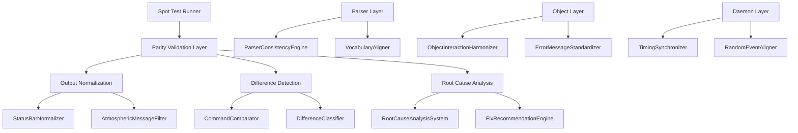

# Design Document: Achieve 99% Parity

## Overview

This design document outlines the systematic approach to achieving 99% behavioral parity between the TypeScript Zork I implementation and the original Z-Machine implementation. The current parity ranges from 66-76% across different test seeds. The goal is to reduce differences to ≤2 per 200 commands (99% parity) consistently.

The approach leverages existing infrastructure in `src/parity/` and `src/testing/comprehensiveParityAnalysis/` while implementing targeted fixes for each category of differences identified through root cause analysis.

## Architecture

The parity improvement system follows a layered architecture:



## Components and Interfaces

### 1. ParserConsistencyEngine (Enhanced)

**Location:** `src/parity/ParserConsistencyEngine.ts`

**Purpose:** Ensures parser behavior matches Z-Machine exactly, including error message format and priority.

**Key Enhancements:**
- Add error message priority logic (unknown word → object not visible → action not possible)
- Expand UNKNOWN_WORDS set with all non-Z-Machine vocabulary
- Add verb-specific "What do you want to [verb]?" messages

```typescript
interface ParserErrorResult {
  errorType: 'UNKNOWN_WORD' | 'OBJECT_NOT_VISIBLE' | 'ACTION_NOT_POSSIBLE';
  message: string;
  priority: number;
}

// Error priority: UNKNOWN_WORD (1) > OBJECT_NOT_VISIBLE (2) > ACTION_NOT_POSSIBLE (3)
getParserError(word: string, isKnown: boolean, isVisible: boolean): ParserErrorResult
```

### 2. ObjectInteractionHarmonizer (Enhanced)

**Location:** `src/parity/ObjectInteractionHarmonizer.ts`

**Purpose:** Standardizes object interaction error messages to match Z-Machine exactly.

**Key Enhancements:**
- Add scenery-specific error messages ("What a concept!", "An interesting idea...")
- Fix TURN/PUSH/PULL error messages
- Fix PUT possession error ("You don't have that!" vs "You can't see any X here!")

```typescript
interface SceneryErrorMapping {
  objectId: string;
  verb: string;
  zmMessage: string;
}

// New mappings for scenery objects
const SCENERY_ERROR_MAPPINGS: SceneryErrorMapping[] = [
  { objectId: 'FOREST', verb: 'TAKE', zmMessage: "What a concept!" },
  { objectId: 'WHITE-HOUSE', verb: 'OPEN', zmMessage: "I can't see how to get in from here." },
  { objectId: 'BOARD', verb: 'PULL', zmMessage: "You can't move the board." },
  // ... more mappings
];
```

### 3. VocabularyAligner

**Location:** `src/parity/VocabularyAligner.ts` (new file)

**Purpose:** Ensures vocabulary recognition matches Z-Machine exactly.

```typescript
interface VocabularyAligner {
  // Words NOT in Z-Machine vocabulary
  readonly UNKNOWN_WORDS: Set<string>;
  
  // Check if word is in Z-Machine vocabulary
  isZMachineWord(word: string): boolean;
  
  // Get canonical form for synonyms
  getCanonicalForm(word: string): string;
  
  // Validate vocabulary alignment
  validateAlignment(): VocabularyValidationResult;
}
```

### 4. ErrorMessageStandardizer

**Location:** `src/parity/ErrorMessageStandardizer.ts` (new file)

**Purpose:** Centralizes all Z-Machine error message formats for consistency.

```typescript
interface ErrorMessageStandardizer {
  // Standard Z-Machine error messages
  readonly MESSAGES: {
    UNKNOWN_WORD: (word: string) => string;  // "I don't know the word 'X'."
    OBJECT_NOT_VISIBLE: (obj: string) => string;  // "You can't see any X here!"
    VERB_NEEDS_OBJECT: (verb: string) => string;  // "What do you want to [verb]?"
    DONT_HAVE: () => string;  // "You don't have that!"
    CONTAINER_CLOSED: (container: string) => string;  // "The X is closed."
    // ... more messages
  };
  
  // Get appropriate error for context
  getError(context: ErrorContext): string;
}
```

### 5. DaemonTimingSynchronizer

**Location:** `src/parity/DaemonTimingSynchronizer.ts` (new file)

**Purpose:** Ensures daemon timing matches Z-Machine intervals.

```typescript
interface DaemonTimingSynchronizer {
  // Lamp timing constants (from ZIL)
  readonly LAMP_WARN_1: number;  // First warning
  readonly LAMP_WARN_2: number;  // Second warning
  readonly LAMP_DEAD: number;    // Lamp dies
  
  // Candle timing constants
  readonly CANDLE_WARN_1: number;
  readonly CANDLE_WARN_2: number;
  readonly CANDLE_DEAD: number;
  
  // Thief appearance probability
  readonly THIEF_PROBABILITY: number;
  
  // Synchronize daemon timing with Z-Machine
  synchronizeTiming(state: GameState): void;
}
```

### 6. AtmosphericMessageAligner

**Location:** `src/parity/AtmosphericMessageAligner.ts` (new file)

**Purpose:** Ensures atmospheric messages match Z-Machine timing and content.

```typescript
interface AtmosphericMessageAligner {
  // Message probability per location type
  readonly FOREST_MESSAGE_PROBABILITY: number;
  readonly UNDERGROUND_MESSAGE_PROBABILITY: number;
  
  // Align message generation with Z-Machine
  alignMessages(state: GameState, seed: number): void;
  
  // Get deterministic message for seed
  getMessageForSeed(location: string, seed: number, moveCount: number): string | null;
}
```

## Data Models

### CommandDifference (Enhanced)

```typescript
interface CommandDifference {
  command: string;
  tsOutput: string;
  zMachineOutput: string;
  differenceType: DifferenceType;
  rootCause: RootCauseCategory;
  severity: 'low' | 'medium' | 'high' | 'critical';
  fixable: boolean;
  suggestedFix?: string;
}
```

### ParityValidationResult

```typescript
interface ParityValidationResult {
  seed: number;
  totalCommands: number;
  matchingCommands: number;
  differences: CommandDifference[];
  parityPercentage: number;
  categorySummary: Record<RootCauseCategory, number>;
  passed: boolean;  // true if >= 99%
}
```

### FixValidationResult

```typescript
interface FixValidationResult {
  fixId: string;
  category: RootCauseCategory;
  beforeParity: number;
  afterParity: number;
  differencesFixed: number;
  regressionsIntroduced: number;
  passed: boolean;
}
```

## Correctness Properties

*A property is a characteristic or behavior that should hold true across all valid executions of a system—essentially, a formal statement about what the system should do. Properties serve as the bridge between human-readable specifications and machine-verifiable correctness guarantees.*

### Property 1: Error Message Priority

*For any* command containing an unknown word, the parser SHALL return "I don't know the word 'X'." before checking object visibility or action validity.

**Validates: Requirements 1.1, 1.2, 3.3**

### Property 2: Verb Object Requirement Messages

*For any* verb that requires a direct object, when invoked without one, the parser SHALL return "What do you want to [verb]?" with the exact verb phrasing used by Z-Machine.

**Validates: Requirements 1.3**

### Property 3: Whitespace and Malformed Input Handling

*For any* input consisting entirely of whitespace, the parser SHALL return "I beg your pardon?". *For any* input with excessive repetition or invalid special characters, the parser SHALL return "I don't understand that sentence."

**Validates: Requirements 1.5, 1.6**

### Property 4: Object Action Error Messages

*For any* object and action combination, the error message returned SHALL exactly match the Z-Machine error message for that combination. This includes scenery objects ("What a concept!"), tool-required actions ("Your bare hands don't appear to be enough."), and possession errors ("You don't have that!").

**Validates: Requirements 2.2, 2.3, 2.6, 10.2, 10.3, 10.4, 10.5**

### Property 5: Vocabulary Recognition Consistency

*For any* word in the Z-Machine vocabulary, the TypeScript parser SHALL recognize it. *For any* word NOT in the Z-Machine vocabulary (including "room", "area", "place", etc.), the parser SHALL return "I don't know the word 'X'."

**Validates: Requirements 3.1, 3.2, 3.3, 3.4**

### Property 6: Status Bar Normalization Round-Trip

*For any* game output containing status bar content, normalizing the output SHALL remove all status bar lines while preserving all other content exactly. Normalizing an already-normalized output SHALL produce identical output (idempotence).

**Validates: Requirements 4.1, 4.2, 4.3**

### Property 7: Deterministic Random Events

*For any* fixed random seed, the sequence of daemon events (thief appearance, atmospheric messages) SHALL be identical across multiple runs. The timing and content SHALL match Z-Machine behavior for the same seed.

**Validates: Requirements 5.3, 5.5, 6.1, 6.3, 6.4**

### Property 8: Container and Inventory State Consistency

*For any* container operation (PUT, TAKE FROM), the error messages and state changes SHALL match Z-Machine exactly. Closed containers SHALL produce "The X is closed." errors. Inventory state SHALL track identically to Z-Machine.

**Validates: Requirements 7.1, 7.2, 7.4**

### Property 9: Ambiguity Resolution Consistency

*For any* ambiguous command, the disambiguation prompt SHALL match Z-Machine format exactly. Two-object ambiguity SHALL use "Which X do you mean, the Y or the Z?" format. Multi-object ambiguity SHALL use "Which X do you mean?" format.

**Validates: Requirements 8.1, 8.2, 8.3**

### Property 10: Parity Validation Threshold

*For any* test seed in the validation set (12345, 67890, 54321, 99999, 11111), the parity percentage SHALL be ≥99% (≤2 differences per 200 commands). Any decrease in parity after a change SHALL be flagged as a regression.

**Validates: Requirements 9.4, 9.5**

## Error Handling

### Parser Errors

1. **Unknown Word**: Return "I don't know the word 'X'." - highest priority
2. **Object Not Visible**: Return "You can't see any X here!" - medium priority
3. **Action Not Possible**: Return action-specific message - lowest priority

### Daemon Errors

1. **Timing Mismatch**: Log warning and adjust timing
2. **Message Mismatch**: Log warning and use Z-Machine message

### Validation Errors

1. **Parity Below Threshold**: Report detailed differences and recommendations
2. **Regression Detected**: Block merge and report regression details

## Testing Strategy

### Unit Tests

Unit tests verify specific examples and edge cases:

1. **Parser Error Messages**: Test each error type with specific inputs
2. **Object Interaction Messages**: Test each scenery object and action
3. **Vocabulary Recognition**: Test known and unknown words
4. **Status Bar Normalization**: Test various status bar formats
5. **Container Operations**: Test PUT/TAKE with open/closed containers

### Property-Based Tests

Property tests verify universal properties across many generated inputs using fast-check:

1. **Error Message Priority Property**: Generate random commands with unknown/known words
2. **Vocabulary Recognition Property**: Generate random words and verify classification
3. **Status Bar Normalization Property**: Generate random outputs with/without status bars
4. **Deterministic Events Property**: Generate random seeds and verify reproducibility
5. **Parity Threshold Property**: Run full parity tests across all seeds

### Integration Tests

1. **Multi-Seed Parity Validation**: Run spot tests with all 5 seeds
2. **Regression Detection**: Compare before/after parity for changes
3. **End-to-End Command Sequences**: Test realistic gameplay sequences

### Test Configuration

- Property tests: Minimum 100 iterations per property
- Parity tests: 200 commands per seed, 5 seeds
- Timeout: 60 seconds per seed for thorough testing
- Pass threshold: 99% parity (≤2 differences)
