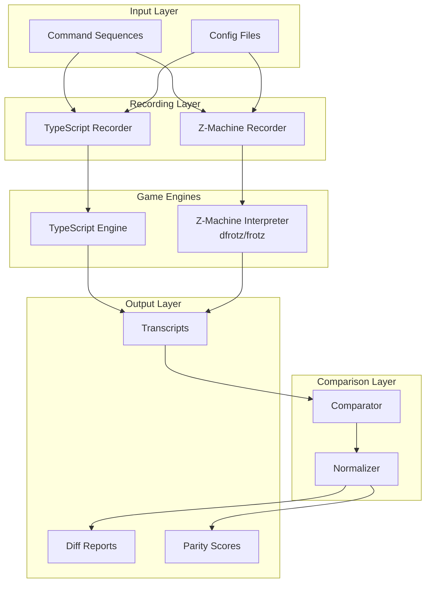

# Design Document: Game Recording and Comparison System

## Overview

This document describes the design of a testing utility system that records gameplay sessions from both the TypeScript Zork I implementation and the original game (via Z-machine interpreter), then compares the outputs to verify behavioral parity.

The system is designed as a standalone testing tool, separate from the main game code, located in `src/testing/` and `scripts/`. It builds upon the existing `TranscriptComparator` and `ScriptRunner` infrastructure while adding the capability to record from the original z3 file.

## Architecture



## Components and Interfaces

### 1. GameRecorder (Abstract Base)

Base class for recording game sessions.

```typescript
interface RecordingOptions {
  seed?: number;              // Random seed for deterministic behavior
  captureTimestamps?: boolean; // Include timestamps in transcript
  preserveFormatting?: boolean; // Preserve exact whitespace
}

interface TranscriptEntry {
  index: number;
  command: string;
  output: string;
  timestamp?: number;
  turnNumber: number;
}

interface Transcript {
  id: string;
  source: 'typescript' | 'z-machine';
  startTime: Date;
  endTime: Date;
  entries: TranscriptEntry[];
  metadata: {
    seed?: number;
    interpreterPath?: string;
    gameVersion?: string;
  };
}

abstract class GameRecorder {
  abstract record(commands: string[], options?: RecordingOptions): Promise<Transcript>;
  abstract isAvailable(): Promise<boolean>;
}
```

### 2. TypeScriptRecorder

Records sessions from the TypeScript game engine.

```typescript
class TypeScriptRecorder extends GameRecorder {
  private executor: CommandExecutor;
  private parser: Parser;
  
  constructor() {
    // Initialize game engine components
  }
  
  async record(commands: string[], options?: RecordingOptions): Promise<Transcript> {
    // Create fresh game state
    // Enable deterministic random if seed provided
    // Execute each command and capture output
    // Return transcript
  }
  
  async isAvailable(): Promise<boolean> {
    return true; // Always available
  }
}
```

### 3. ZMachineRecorder

Records sessions from the original z3 file via external interpreter.

```typescript
interface ZMachineConfig {
  interpreterPath: string;  // Path to dfrotz/frotz executable
  gameFilePath: string;     // Path to zork1.z3
  timeout?: number;         // Command timeout in ms
}

class ZMachineRecorder extends GameRecorder {
  private config: ZMachineConfig;
  private process: ChildProcess | null = null;
  
  constructor(config: ZMachineConfig) {
    this.config = config;
  }
  
  async record(commands: string[], options?: RecordingOptions): Promise<Transcript> {
    // Spawn interpreter process
    // Send commands via stdin
    // Capture output from stdout
    // Parse and structure output
    // Return transcript
  }
  
  async isAvailable(): Promise<boolean> {
    // Check if interpreter exists and is executable
    // Check if game file exists
  }
  
  private async spawnInterpreter(): Promise<void> {
    // Start dfrotz with appropriate flags
    // -p: plain ASCII output
    // -w: set screen width
  }
  
  private async sendCommand(command: string): Promise<string> {
    // Write command to stdin
    // Read output until prompt
    // Return captured output
  }
}
```

### 4. TranscriptComparator

Compares two transcripts and produces diff reports.

```typescript
interface ComparisonOptions {
  normalizeWhitespace?: boolean;
  ignoreCaseInMessages?: boolean;
  knownVariations?: string[];  // Patterns for expected differences
  toleranceThreshold?: number; // 0-1, similarity threshold for "match"
}

interface DiffEntry {
  index: number;
  command: string;
  expected: string;
  actual: string;
  similarity: number;
  severity: 'critical' | 'major' | 'minor' | 'formatting';
  category: string;
}

interface DiffReport {
  transcriptA: string;
  transcriptB: string;
  totalCommands: number;
  exactMatches: number;
  closeMatches: number;  // Above tolerance threshold
  differences: DiffEntry[];
  parityScore: number;   // 0-100 percentage
  summary: {
    critical: number;
    major: number;
    minor: number;
    formatting: number;
  };
}

class TranscriptComparator {
  compare(
    transcriptA: Transcript,
    transcriptB: Transcript,
    options?: ComparisonOptions
  ): DiffReport {
    // Align entries by command index
    // Compare each pair of outputs
    // Classify differences by severity
    // Calculate parity score
    // Return structured report
  }
  
  private normalizeOutput(output: string): string {
    // Normalize whitespace
    // Normalize line endings
    // Optionally normalize case
  }
  
  private calculateSimilarity(a: string, b: string): number {
    // Character-level similarity after normalization
  }
  
  private classifySeverity(diff: DiffEntry): 'critical' | 'major' | 'minor' | 'formatting' {
    // Formatting: whitespace-only differences
    // Minor: punctuation, case differences
    // Major: word differences but same meaning
    // Critical: completely different content
  }
}
```

### 5. CommandSequenceLoader

Loads and parses command sequence files.

```typescript
interface CommandSequence {
  id: string;
  name: string;
  description?: string;
  commands: string[];
  metadata?: Record<string, string>;
}

class CommandSequenceLoader {
  load(filePath: string): CommandSequence {
    // Read file
    // Parse commands (one per line)
    // Handle comments (# prefix)
    // Handle includes (@include path)
    // Return structured sequence
  }
  
  loadDirectory(dirPath: string): CommandSequence[] {
    // Load all .txt files in directory
    // Return array of sequences
  }
  
  private parseFile(content: string, basePath: string): string[] {
    // Split by newlines
    // Filter comments
    // Resolve includes recursively
    // Return command list
  }
}
```

### 6. BatchRunner

Executes multiple command sequences and aggregates results.

```typescript
interface BatchOptions {
  parallel?: boolean;
  maxConcurrency?: number;
  stopOnFailure?: boolean;
}

interface BatchResult {
  sequences: Array<{
    id: string;
    name: string;
    parityScore: number;
    diffCount: number;
    executionTime: number;
  }>;
  aggregateParityScore: number;
  totalDifferences: number;
  worstSequences: string[];  // IDs of sequences with most differences
}

class BatchRunner {
  constructor(
    private tsRecorder: TypeScriptRecorder,
    private zmRecorder: ZMachineRecorder,
    private comparator: TranscriptComparator
  ) {}
  
  async run(
    sequences: CommandSequence[],
    options?: BatchOptions
  ): Promise<BatchResult> {
    // Execute each sequence against both engines
    // Compare transcripts
    // Aggregate results
    // Rank by difference count
  }
}
```

### 7. ReportGenerator

Generates human-readable and machine-parseable reports.

```typescript
type ReportFormat = 'text' | 'json' | 'markdown' | 'html';

class ReportGenerator {
  generate(report: DiffReport, format: ReportFormat): string {
    switch (format) {
      case 'text': return this.generateText(report);
      case 'json': return this.generateJSON(report);
      case 'markdown': return this.generateMarkdown(report);
      case 'html': return this.generateHTML(report);
    }
  }
  
  generateBatchReport(result: BatchResult, format: ReportFormat): string {
    // Generate aggregate report for batch runs
  }
}
```

## Data Models

### Transcript File Format (JSON)

```json
{
  "id": "exploration-basic",
  "source": "typescript",
  "startTime": "2024-01-15T10:30:00Z",
  "endTime": "2024-01-15T10:30:05Z",
  "entries": [
    {
      "index": 0,
      "command": "look",
      "output": "West of House\nYou are standing in an open field...",
      "timestamp": 1705315800000,
      "turnNumber": 0
    }
  ],
  "metadata": {
    "seed": 12345,
    "gameVersion": "1.0.0"
  }
}
```

### Command Sequence File Format (Text)

```text
# Basic exploration sequence
# Tests room descriptions and navigation

look
inventory
open mailbox
read leaflet
go north
# Continue exploring...

@include common/setup.txt
```

### Configuration File Format (JSON)

```json
{
  "interpreterPath": "/usr/local/bin/dfrotz",
  "gameFilePath": "COMPILED/zork1.z3",
  "defaultSeed": 12345,
  "comparisonOptions": {
    "normalizeWhitespace": true,
    "toleranceThreshold": 0.95
  },
  "knownVariations": [
    "combat outcome",
    "thief movement"
  ]
}
```

## Correctness Properties

*A property is a characteristic or behavior that should hold true across all valid executions of a system—essentially, a formal statement about what the system should do. Properties serve as the bridge between human-readable specifications and machine-verifiable correctness guarantees.*

### Property 1: Recording Completeness

*For any* valid command sequence, when recorded by either the TypeScript or Z-Machine recorder, the resulting transcript SHALL contain exactly one entry per command, with each entry including the command text, output, and turn number.

**Validates: Requirements 1.1, 1.2, 1.3**

### Property 2: Output Fidelity (Round-Trip)

*For any* game output produced during recording, if the output is captured and then compared character-by-character with the original output, they SHALL be identical (preserving exact formatting and whitespace).

**Validates: Requirements 1.4**

### Property 3: Error Resilience

*For any* command that causes a game error or exception, the recorder SHALL capture the error message in the transcript and continue recording subsequent commands without terminating.

**Validates: Requirements 1.5**

### Property 4: Cross-Platform Recording Consistency

*For any* command sequence executed against both the TypeScript engine and Z-Machine interpreter, both resulting transcripts SHALL have the same structure (same number of entries, same command ordering) regardless of output content differences.

**Validates: Requirements 2.1, 2.2**

### Property 5: Difference Detection Completeness

*For any* two transcripts with differing outputs, the comparator SHALL identify all differences, classify each by severity, and include the source command for every difference in the report.

**Validates: Requirements 3.1, 3.2, 3.3, 3.5, 4.1, 4.2, 4.3**

### Property 6: Parity Score Calculation

*For any* comparison of two transcripts, the parity score SHALL equal (number of matching outputs / total commands) × 100, where "matching" is defined by the configured tolerance threshold.

**Validates: Requirements 3.4, 6.2**

### Property 7: Command Sequence Parsing (Round-Trip)

*For any* valid command sequence file, parsing the file and then serializing the commands back to a file (ignoring comments) SHALL produce a sequence that, when parsed again, yields identical commands.

**Validates: Requirements 5.1, 5.2, 5.4**

### Property 8: Batch Execution Independence

*For any* set of command sequences run in batch mode, each sequence SHALL produce an independent transcript, and the aggregate parity score SHALL equal the weighted average of individual scores.

**Validates: Requirements 6.1, 6.3**

### Property 9: Deterministic Behavior

*For any* command sequence executed twice with the same random seed, the TypeScript recorder SHALL produce identical transcripts (byte-for-byte identical output for each command).

**Validates: Requirements 7.1, 7.3, 7.4**

## Error Handling

### Interpreter Errors

- **Interpreter not found**: Clear error message with installation instructions
- **Game file not found**: Error with expected path
- **Interpreter crash**: Capture partial transcript, report error location
- **Timeout**: Configurable per-command timeout, report hung command

### Recording Errors

- **Game exception**: Capture stack trace in transcript metadata, continue
- **Invalid command**: Record error message as output, continue
- **State corruption**: Detect via sanity checks, abort with diagnostic info

### Comparison Errors

- **Mismatched transcript lengths**: Report as critical error, show missing commands
- **Encoding issues**: Normalize to UTF-8, flag encoding differences
- **Memory limits**: Stream large transcripts, don't load entirely into memory

## Testing Strategy

### Unit Tests

Unit tests verify specific examples and edge cases:

- Command sequence file parsing with various formats
- Output normalization edge cases
- Similarity calculation accuracy
- Severity classification logic
- Report generation formatting

### Property-Based Tests

Property tests verify universal properties across all inputs using fast-check:

- **Recording completeness**: Generate random command sequences, verify transcript structure
- **Round-trip fidelity**: Record output, verify exact preservation
- **Parsing round-trip**: Generate command files, parse and re-serialize
- **Parity score calculation**: Generate transcript pairs, verify score formula
- **Deterministic behavior**: Same seed produces same output

### Integration Tests

- Full recording workflow with TypeScript engine
- Z-Machine integration (when interpreter available)
- Batch execution with multiple sequences
- Report generation in all formats

### Test Configuration

```typescript
// Property test configuration
const propertyTestConfig = {
  numRuns: 100,  // Minimum iterations per property
  seed: 12345,   // Reproducible test runs
};
```

Each property test must be tagged with its design document reference:
```typescript
// Feature: game-recording-comparison, Property 1: Recording Completeness
```
