# Design Document: Integrate Message Extraction into Parity Validation

## Overview

This design addresses the critical integration gap in the parity validation pipeline. The `ExhaustiveParityValidator.compareAndClassify()` method currently compares raw outputs directly and calls `classifyDifference()` with raw strings, bypassing the `MessageExtractor` and `classifyExtracted()` methods that were specifically built to handle this.

The solution is to refactor `ExhaustiveParityValidator.compareAndClassify()` to delegate to `TranscriptComparator.compareAndClassify()`, which already properly uses message extraction and classification. This will ensure status bar differences are completely isolated from logic comparison.

## Architecture

```mermaid
flowchart TD
    subgraph Current["Current Flow (Broken)"]
        A1[ExhaustiveParityValidator] --> B1[compareAndClassify]
        B1 --> C1[normalizeOutput - basic]
        C1 --> D1[classifyDifference - raw strings]
        D1 --> E1[LOGIC_DIFFERENCE - 12,996+ false positives]
    end
    
    subgraph Fixed["Fixed Flow"]
        A2[ExhaustiveParityValidator] --> B2[compareAndClassify]
        B2 --> C2[TranscriptComparator.compareAndClassify]
        C2 --> D2[MessageExtractor.extractActionResponse]
        D2 --> E2[Strip status bar, headers, prompts]
        E2 --> F2[classifyExtracted - extracted messages]
        F2 --> G2[Accurate classification]
    end
```



## Components and Interfaces

### Modified: ExhaustiveParityValidator

The `compareAndClassify` method will be refactored to delegate to `TranscriptComparator`:

```typescript
interface ExhaustiveParityValidator {
  // Existing methods unchanged
  runWithSeeds(seeds?: number[]): Promise<ParityResults>;
  runWithSeed(seed: number): Promise<SeedResult>;
  runExtendedSequence(seed: number, commandCount?: number): Promise<ExtendedSequenceResult>;
  
  // Internal method - refactored
  private compareAndClassify(
    tsTranscript: Transcript,
    zmTranscript: Transcript,
    commands: string[]
  ): ComparisonResult;
}

interface ComparisonResult {
  matchingResponses: number;
  differences: ClassifiedDifference[];
  statusBarDifferences: number;  // NEW: Track separately
}
```

### Extended: ParityResults

Add status bar tracking to results:

```typescript
interface ParityResults {
  // Existing fields
  totalTests: number;
  totalDifferences: number;
  rngDifferences: number;
  stateDivergences: number;
  logicDifferences: number;
  seedResults: Map<number, SeedResult>;
  overallParityPercentage: number;
  totalExecutionTime: number;
  passed: boolean;
  summary: string;
  
  // NEW: Status bar tracking
  statusBarDifferences: number;
  logicParityPercentage: number;  // Excludes status bar
}
```

### Extended: SeedResult

Add status bar tracking per seed:

```typescript
interface SeedResult {
  // Existing fields
  seed: number;
  totalCommands: number;
  matchingResponses: number;
  differences: ClassifiedDifference[];
  parityPercentage: number;
  executionTime: number;
  success: boolean;
  error?: string;
  
  // NEW: Status bar tracking
  statusBarDifferences: number;
  logicParityPercentage: number;  // Excludes status bar
}
```

## Data Models

### ExtractedMessage (existing)

```typescript
interface ExtractedMessage {
  response: string;           // Extracted action response (no status bar)
  roomDescription?: string;   // Room description if present
  isMovement: boolean;        // Whether this was a movement command
  originalOutput: string;     // Original full output for debugging
}
```

### ClassifiedDifference (existing)

```typescript
interface ClassifiedDifference {
  commandIndex: number;
  command: string;
  tsOutput: string;
  zmOutput: string;
  classification: 'RNG_DIFFERENCE' | 'STATE_DIVERGENCE' | 'LOGIC_DIFFERENCE';
  reason: string;
}
```


## Correctness Properties

*A property is a characteristic or behavior that should hold true across all valid executions of a system—essentially, a formal statement about what the system should do. Properties serve as the bridge between human-readable specifications and machine-verifiable correctness guarantees.*

### Property 1: Message Extraction Pipeline

*For any* transcript entry comparison in ExhaustiveParityValidator, the comparison SHALL use extracted action responses (via MessageExtractor) rather than raw outputs, and classification SHALL use classifyExtracted() with ExtractedMessage objects.

**Validates: Requirements 1.1, 1.2, 1.3**

### Property 2: Status Bar Isolation

*For any* two outputs that differ only in status bar content (Score/Moves line), the ExhaustiveParityValidator SHALL:
- Count this as a matching response (not a difference)
- Track the status bar difference separately in statusBarDifferences
- NOT classify this as LOGIC_DIFFERENCE
- NOT cause the test to fail (passed=true)

**Validates: Requirements 4.1, 4.2, 4.3, 4.4**

### Property 3: Non-Logic Differences Don't Affect Parity

*For any* two outputs where the extracted action responses are identical (after status bar/header removal), OR where the difference is classified as RNG_DIFFERENCE or STATE_DIVERGENCE, the ExhaustiveParityValidator SHALL count this as a matching response and NOT reduce the parity percentage.

**Validates: Requirements 5.1, 5.2, 6.1, 6.2**

### Property 4: Parity Calculation Accuracy

*For any* set of transcript comparisons, the parity percentage SHALL equal:
`(matchingResponses + rngDifferences + stateDivergences) / totalCommands * 100`

Where only LOGIC_DIFFERENCE classifications reduce the parity percentage.

**Validates: Requirements 6.1, 6.2, 6.3**

### Property 5: API Compatibility (Round-Trip)

*For any* call to runWithSeeds() or runWithSeed(), the returned SeedResult and ParityResults objects SHALL contain all existing fields with the same types, plus the new statusBarDifferences and logicParityPercentage fields.

**Validates: Requirements 3.1, 3.2, 3.3**

### Property 6: RNG Classification Accuracy

*For any* two outputs where both extracted responses are from the same RNG pool (YUKS, HO_HUM, HELLOS, WHEEEEE, JUMPLOSS), the DifferenceClassifier SHALL classify this as RNG_DIFFERENCE, not LOGIC_DIFFERENCE.

**Validates: Requirements 5.3, 5.4**

## Error Handling

### Missing Transcript Entries
- If one transcript has fewer entries than the other, the missing entries are classified as LOGIC_DIFFERENCE
- This is a critical difference that should fail the test

### MessageExtractor Failures
- If extraction fails, fall back to raw output comparison
- Log a warning but continue processing

### Z-Machine Unavailable
- If Z-Machine recorder is not available, return TypeScript-only results with 100% parity
- Include error message in result

## Testing Strategy

### Unit Tests
- Test that compareAndClassify delegates to TranscriptComparator
- Test that options are configured correctly (useMessageExtraction: true)
- Test result mapping from ExtendedDiffReport to ClassifiedDifference[]
- Test status bar difference tracking

### Property-Based Tests
- **Property 1**: Generate random transcript entries, verify extraction is used
- **Property 2**: Generate outputs differing only in status bar, verify isolation
- **Property 3**: Generate outputs with RNG differences, verify they count as matches
- **Property 4**: Generate various difference scenarios, verify parity calculation
- **Property 5**: Call API methods, verify return type structure
- **Property 6**: Generate RNG pool messages, verify classification

### Integration Tests
- Run full parity validation with known transcripts
- Verify status bar differences don't affect logic parity
- Verify the parity percentage improves dramatically after fix

### Test Configuration
- Use fast-check for property-based testing
- Minimum 100 iterations per property test
- Tag format: **Feature: integrate-message-extraction, Property N: description**
