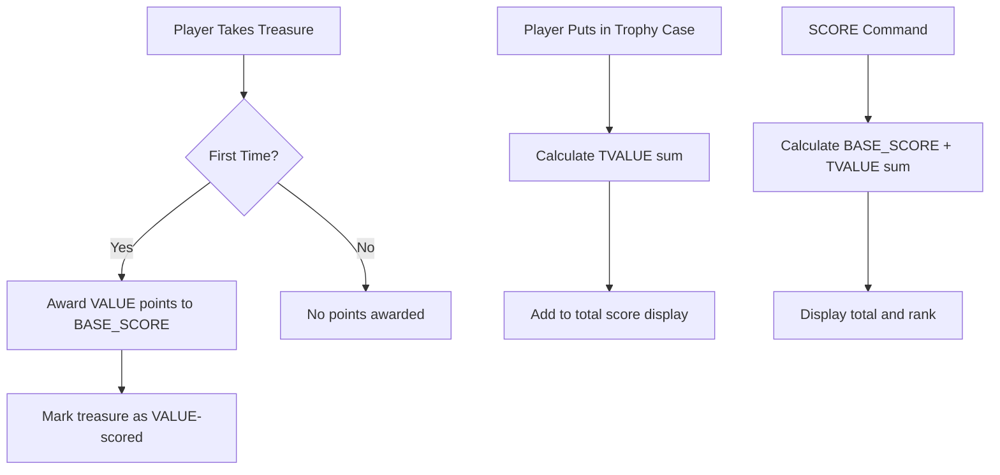

# Design Document: Treasure Take Scoring

## Overview

This design implements the two-part treasure scoring system from the original Zork I ZIL source. The key change is adding VALUE point awards when treasures are first taken, in addition to the existing TVALUE points when placing treasures in the trophy case.

## Architecture

The scoring system follows the original ZIL architecture:

```
TOTAL_SCORE = BASE_SCORE + OTVAL_FROB(TROPHY_CASE)

Where:
- BASE_SCORE: Accumulated points from VALUE (taking treasures), room entry, combat, puzzles
- OTVAL_FROB: Sum of TVALUE for treasures currently in trophy case
```

### Scoring Flow



## Components and Interfaces

### Modified: `src/game/scoring.ts`

```typescript
/**
 * Treasure take values (VALUE) - points when first taking
 * From ZIL P?VALUE property on objects
 */
export const TREASURE_TAKE_VALUES: Record<string, number> = {
  'SKULL': 10,
  'SCEPTRE': 4,
  'COFFIN': 10,
  'TRIDENT': 4,
  'CHALICE': 10,
  'DIAMOND': 10,
  'JADE': 5,
  'BAG-OF-COINS': 10,
  'EMERALD': 5,
  'PAINTING': 4,
  'BAR': 10,
  'POT-OF-GOLD': 10,
  'BRACELET': 5,
  'SCARAB': 5,
  'TORCH': 14,
  'TRUNK': 15,
  'EGG': 5,
  'BAUBLE': 1,
  'CANARY': 6,
  'BROKEN-EGG': 0,
  'BROKEN-CANARY': 0
};

/**
 * Treasure case values (TVALUE) - points when in trophy case
 * Renamed from TREASURE_VALUES for clarity
 */
export const TREASURE_CASE_VALUES: Record<string, number> = {
  'SKULL': 10,
  'SCEPTRE': 6,
  'COFFIN': 5,
  'TRIDENT': 11,
  'CHALICE': 15,
  'DIAMOND': 10,
  'JADE': 5,
  'BAG-OF-COINS': 5,
  'EMERALD': 10,
  'PAINTING': 6,
  'BAR': 5,
  'POT-OF-GOLD': 10,
  'BRACELET': 5,
  'SCARAB': 5,
  'TORCH': 6,
  'TRUNK': 5,
  'EGG': 5,
  'BAUBLE': 1,
  'CANARY': 4,
  'BROKEN-EGG': 2,
  'BROKEN-CANARY': 1
};

/**
 * Award VALUE points when taking a treasure for the first time
 * Implements ZIL SCORE-OBJ behavior
 */
export function scoreTreasureTake(state: GameState, objectId: string): number;

/**
 * Check if a treasure has had its VALUE points awarded
 */
export function isTreasureTakeScored(state: GameState, objectId: string): boolean;
```

### Modified: `src/game/actions.ts` - TakeAction

```typescript
export class TakeAction implements ActionHandler {
  execute(state: GameState, objectId: string): ActionResult {
    // ... existing take logic ...
    
    // After successful take, award VALUE points if treasure
    const points = scoreTreasureTake(state, objectId);
    
    // ... return result ...
  }
}
```

### Modified: `ACTION_VALUES`

Remove the invalid `OPEN_EGG` entry since players cannot open the egg.

## Data Models

### Treasure Scoring State

Each treasure object tracks whether its VALUE points have been awarded:

```typescript
interface TreasureScoringState {
  valueScoredTreasures: Set<string>;  // Treasures that have had VALUE awarded
}
```

This is stored in `state.globalVariables` under key `'VALUE_SCORED_TREASURES'`.

## Correctness Properties

*A property is a characteristic or behavior that should hold true across all valid executions of a system-essentially, a formal statement about what the system should do. Properties serve as the bridge between human-readable specifications and machine-verifiable correctness guarantees.*

### Property 1: VALUE points awarded on first take only
*For any* treasure object, taking it the first time should increase BASE_SCORE by exactly the treasure's VALUE amount, and taking it again (after dropping) should not change the score.
**Validates: Requirements 1.1, 1.2**

### Property 2: Non-treasures do not affect score on take
*For any* non-treasure object, taking it should not change the player's score.
**Validates: Requirements 1.3**

### Property 3: TVALUE scoring idempotence
*For any* treasure, placing it in the trophy case, removing it, and placing it again should result in the same total score as placing it once.
**Validates: Requirements 2.2**

### Property 4: Total score formula consistency
*For any* game state, the total score should equal BASE_SCORE plus the sum of TVALUE for all treasures currently in the trophy case.
**Validates: Requirements 2.3, 5.1**

### Property 5: Rank consistency with score
*For any* score value, the displayed rank should match the rank thresholds defined in the original game.
**Validates: Requirements 5.2**

## Error Handling

- If a treasure object doesn't exist in `TREASURE_TAKE_VALUES`, return 0 points (not an error)
- If the scoring state is corrupted, reinitialize the `valueScoredTreasures` set
- Maintain backward compatibility with existing save files by initializing missing state

## Testing Strategy

### Unit Tests
- Verify VALUE constants match ZIL source values
- Verify TVALUE constants match ZIL source values
- Verify OPEN_EGG is not in ACTION_VALUES
- Test scoreTreasureTake returns correct points
- Test isTreasureTakeScored tracks state correctly

### Property-Based Tests
- Use fast-check to generate random treasure sequences
- Verify idempotence of VALUE scoring across random take/drop sequences
- Verify total score formula holds for random game states
- Verify rank calculation for random score values

### Integration Tests
- Full take-deposit cycle for multiple treasures
- Score display matches calculated total
- Save/restore preserves VALUE scoring state
